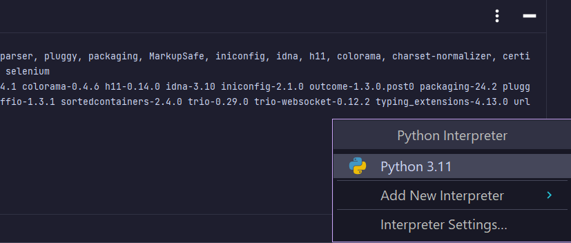

# TojTech Automation Framework

This is the framework created during the TojTech Test Automation course.

## Set Up

1. Clone the repository

```bash
git clone https://github.com/lucas-emg/automation_framework_tojtech.git
```

2. Set up Virtual Environment

Create a virtual env with Python running the following command

```bash
python -m venv tojtech-env
```

Activate the virtual env running the following:

```bash
# On Mac
source tojtech-env/bin/activate
```

```bash
# On Windows (use PowerShell or Command Prompt)
cd tojtech-env/Scripts
activate.bat
```

NOTE: if you are on Windows, you might need to run ``cd ../../`` after activating the environment before doing the next step.

3. Install all dependencies

```bash
pip install -r requirements.txt
```

Wait for Pycharm to finish the indexing.

NOTE: If you are seeing a Pycharm error asking to choose an interpreter, choose your Pycharm version on the right side of the footer

